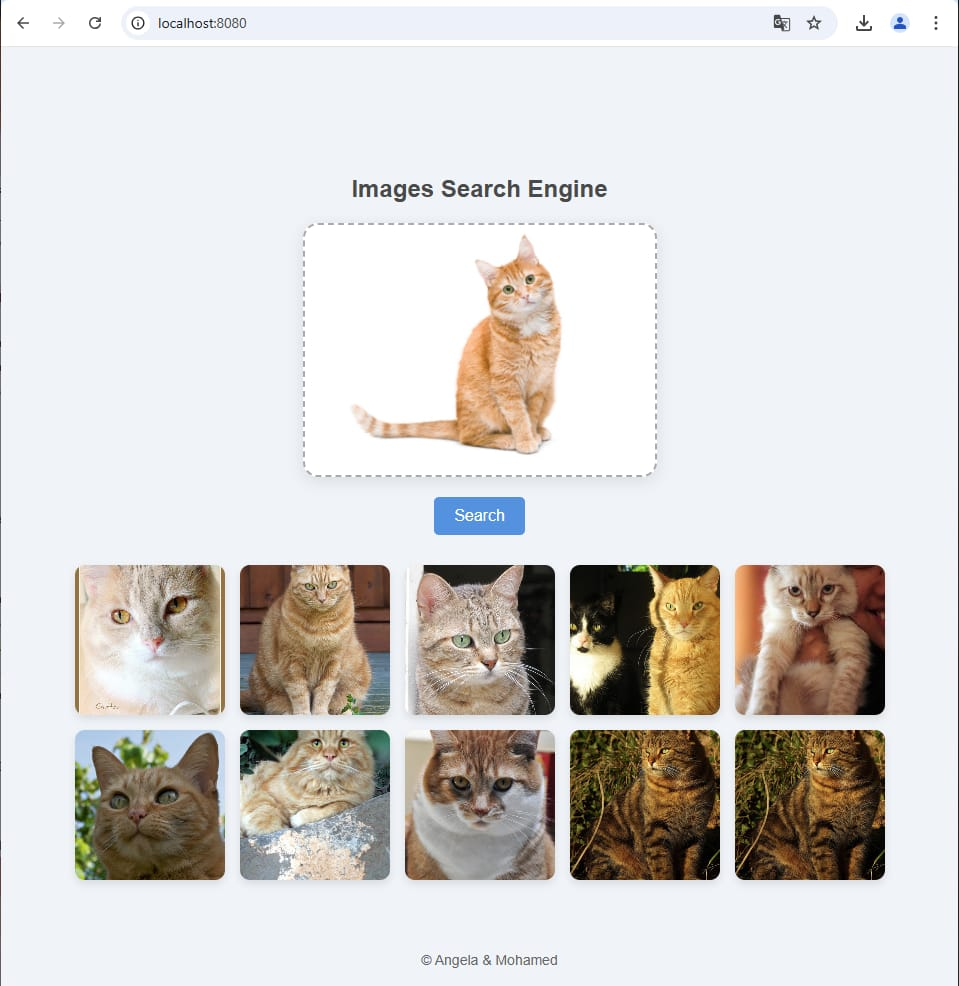

# Image Search Engine with VGG16, Elasticsearch, Flask, and Docker

This project is a high-performance image search engine that leverages deep learning for image feature extraction using VGG16, and utilizes Elasticsearch for fast indexing and retrieval of images. The application uses Flask for the backend API and Docker for containerization, ensuring easy deployment and scalability.


## 📂 Project Architecture
### Key Components:
- **VGG16 Feature Extraction**: The VGG16 deep learning model is used for extracting feature vectors from images.
- **Elasticsearch**: An efficient search engine that indexes image features and enables fast search operations.
- **Flask Backend API**: Handles user requests for searching images based on content similarity.
- **Frontend Interface**: A simple web interface for users to interact with the search engine.
- **Docker**: Containers are used to manage different services (frontend, API, image ingestion) in a seamless and reproducible manner.

## 🚀 How It Works
### 1. VGG16 Feature Extraction
The VGG16 model is used to extract high-level feature vectors from images. These vectors represent key characteristics of the images, such as texture, shape, and color.

### 2. Elasticsearch Integration
Elasticsearch is used to index the feature vectors of the images, enabling fast and accurate searches by similarity.

### 3. Flask API
The backend is powered by Flask, providing a simple API that receives search requests and returns relevant images based on text or image queries.

### 4. Frontend Interface
Users interact with the search engine through the frontend, where they can upload images or enter search queries to find similar images.

### 5. Dockerization
The project is containerized using Docker, with separate services for the frontend, backend API, and image ingestion, all orchestrated using Docker Compose.

## 🎨 Features
- **Image Similarity Search**: Upload an image and find visually similar images.
- **Text-based Search**: Perform searches using image metadata or keywords.
- **VGG16-based Feature Extraction**: Extracts detailed feature vectors for accurate search results.
- **Flask API**: Fast and reliable API to process search requests.
- **Interactive Web Interface**: Easy-to-use frontend built with HTML, CSS, and JavaScript.
- **Dockerized Services**: The project is fully containerized, making it easy to deploy and scale.

## 🛠️ Technology Stack
| Component             | Technology         |
| --------------------- | ------------------ |
| **Feature Extraction** | VGG16       |
| **Search Engine**      | Elasticsearch      |
| **Backend API**        | Flask              |
| **Frontend Interface** | HTML, CSS, JavaScript |
| **Containerization**   | Docker, Docker Compose |

## 🔧 How to Run the Project

### Prerequisites
Ensure you have Docker and Docker Compose installed on your machine. All required Python dependencies are listed in the `requirements.txt` files inside the respective services.

### 1. Clone the Repository
```bash
git clone https://github.com/KaouechMohamed/Images-Search-Engine.git
cd Images-Search-Engine
```
### 2. Build and Start the Application
```bash
docker-compose up --build
```
This will start all the services (frontend, API, and ingestion) as containers.
### 3. Access the Services
Elasticsearch: http://localhost:9200
Middleware API: http://localhost:5000
Frontend: http://localhost:8080

### ⚙️ How the Components Work Together
VGG16 Feature Extraction: Converts images into feature vectors.
Elasticsearch: Stores these feature vectors and allows for efficient similarity-based searches.
Flask API: Processes search requests and returns relevant results.
Frontend Interface: Provides a user-friendly web interface to upload images and perform searches.
Docker: Containerizes all components to ensure consistent and scalable deployment.
### 📊 Results
Search Interface
The interface of the image search engine is designed to be simple and intuitive. Users can upload images, enter search queries, and view similar images from the indexed collection. The backend performs a feature extraction from the uploaded image using VGG16 and finds similar images using Elasticsearch.
